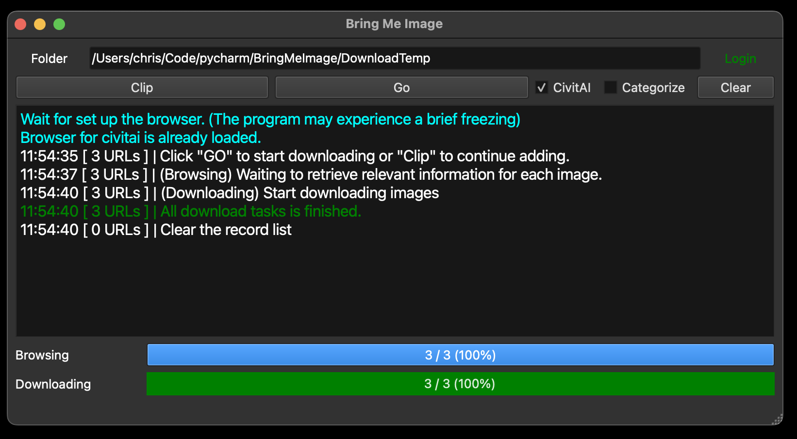
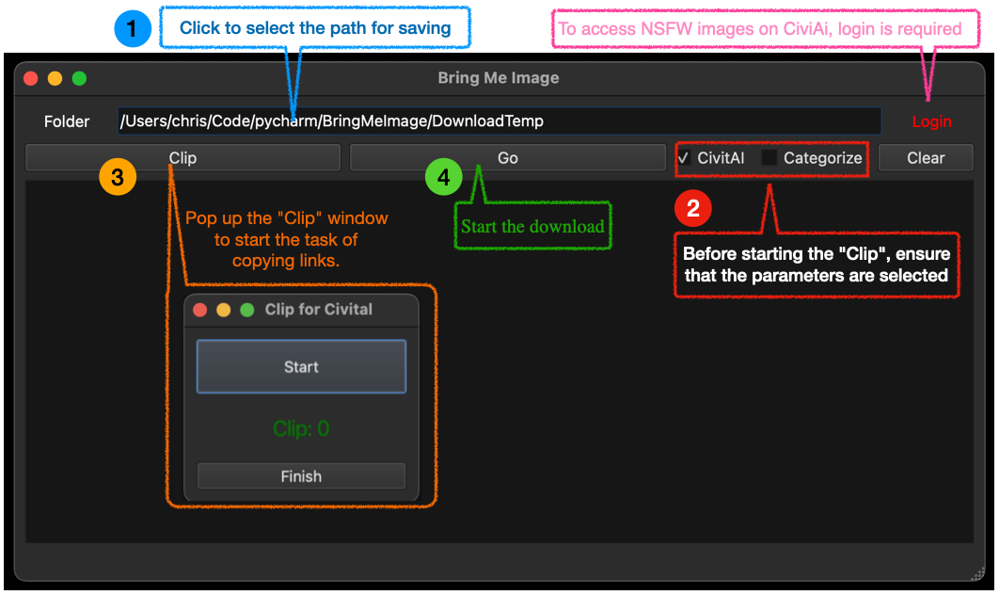
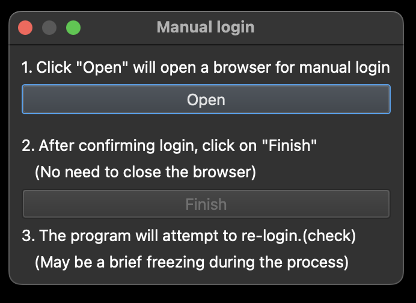

# Bring Me Image

On each model page on civitai.com, there are many images uploaded by creators or regular users. If you often need to click on individual images and use the right-click to download them one by one, this project might be helpful for you.



## Installation 
Use the git clone command to clone the repository.  
(It is recommended to clone the repository within your virtual environment) 
```
git clone https://github.com/ChrisYangTW/BringMeImage.git
```
Switch to the folder where you have placed the repository,
and install the necessary dependencies.
```
pip3 install -r requirements.txt
```
Finally, run the main.py
```
python3 main.py
```

## Usage

1. Two checkboxes
   * CivitAI: Support copying hyperlinks of images in the Gallery (default checked).
   * Categorize: The image will be saved in the corresponding folder based on the model and version. (**No guarantee of expected categorization**)
2. Clip
   * The 'Clip' window will always stay on top, where you can start to begin the task.
   * 
   * "Start": Upon clicking, it will start detecting the links you have copied. After starting, the button will be renamed to "Stop," allowing you to pause the task. This means you can click "Start" again to resume.
   * "Display": If the link meets the format requirements, it will be added to the list, and the current number of additions will be displayed.
   * "Finish": After completing the task, click "Stop" first, and then click the button to return to the main window.
3. Clear
   * Once there is content in "Clip list", two checkboxes will be locked until the download task is completed. Clicking the button will clear the "Clip list" content and unlock the checkbox.
4. Login
   * The first time you log in, a guide window will pop up
   * 
     * Clicking "Open" will open the browser. After successful manual login, click "Finish".
     * Finally, the program will attempt automatic login again to ensure that the obtained cookies can be used for future automatic logins.
     * Double-clicking "Login" will trigger automatic login unless there are no available cookies.
5. Which type of link should be copied?
   1. Checked the "CivitAI" checkbox:
      1. Copy the hyperlinks referred to by the images.
         * Taking Safari browser as an example, you can right-click on the desired image and select "Copy Link" to copy the link.
         * 
      2. In fact, you can observe that these hyperlinks have the same format. If they do not match the format, a message will be displayed in the terminal.
         * "The matching format is `https://civitai.com/images/(number)`
   2. Unchecked the "CivitAI" checkbox:
      1. Copy the static link of the image. As long as you make sure to copy the static link of the image (supporting only .png, .jpg, .jpeg), it will work.
      2. If the link does not end with .png, .jpg, or .jpeg, a message will also be displayed in the terminal.
6. Save and Load "Clip list" Records
   1. Considering the high traffic on Civitai.com, if the server doesn't respond during the "Clipping" process, you can still complete and finish the "Clip" task. Afterward, you can close the main window, and it will prompt you whether you want to save the list. Selecting 'Yes' will automatically save and close the window. (You can also save the records actively. 'Options > Save the Record'.)
   2. The saved file, which is a pickle file, will be stored in the same folder as main.py.
   3. Option > Load Clipboard File. Load Clip Records, you can resume the Clip task or click "GO" to start downloading.


## Test environment
```
Python 3.12
Macbook (OS 14.3)
```

## Additional note
The images content used in the instructions are sourced from civitai.com. If there are any concerns or issues, please let us know. Thank you.

## Supplementary note
The images are shared generously by many users. Please be mindful of the relevant copyright regulations when using them.
