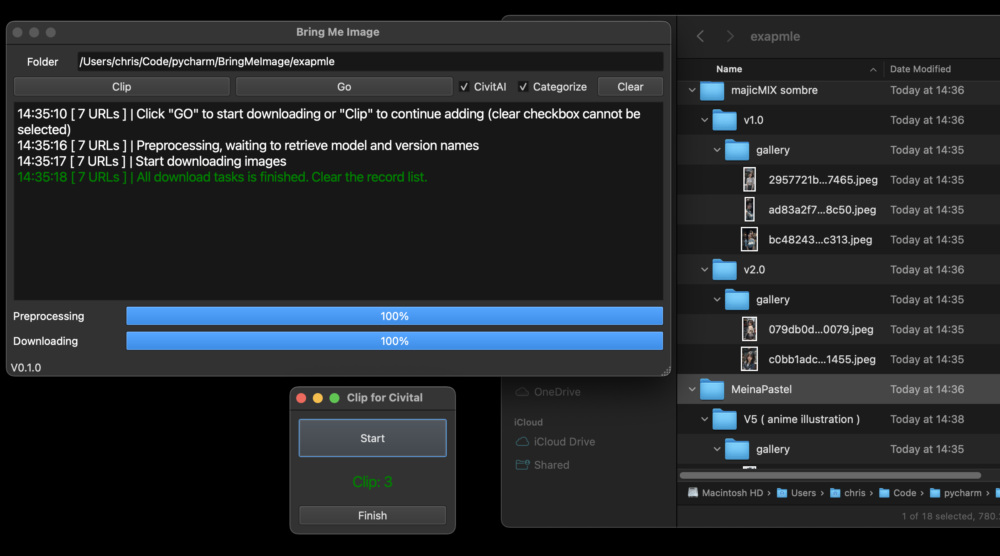
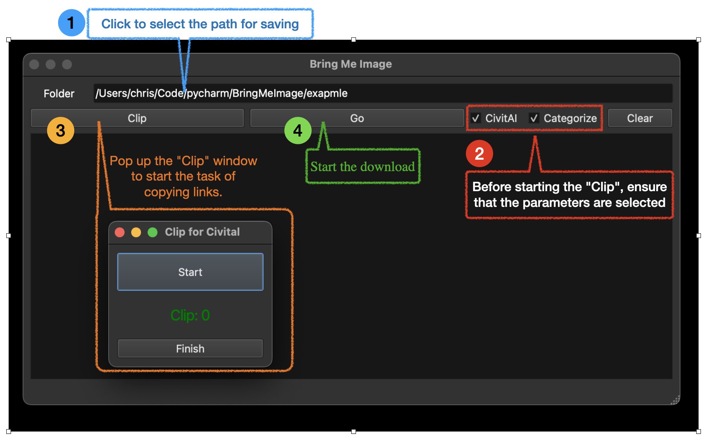
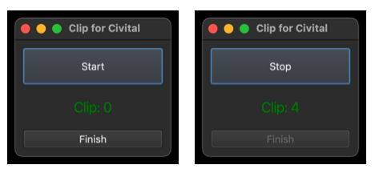
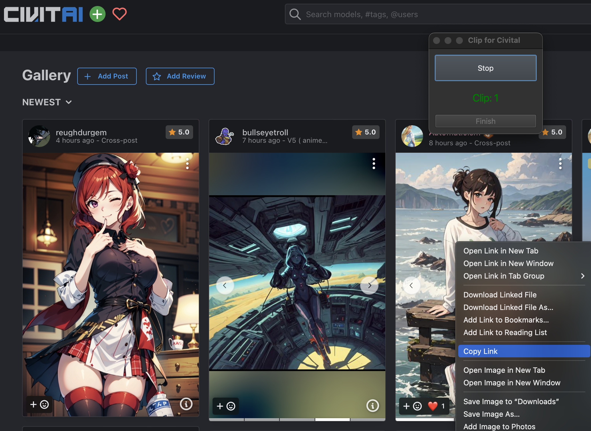
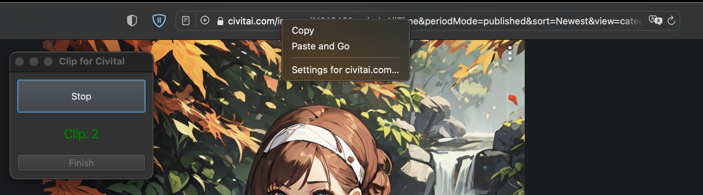

# Bring Me Image (v0.1.0)
In the Gallery section of each model (each version) page on civitai.com, there are many images uploaded by regular users. If you often need to click on individual images and use the right-click to download them one by one, this project might be helpful for you.



## Installation
Use the git clone command to clone the repository.
```
git clone https://github.com/ChrisYangTW/BringMeImage.git
```
Switch to the folder where you have placed the repository,
and install the necessary dependencies.
```
pip3 install -r requirements.txt
```
Finally, run the main.py
```
python3 main.py
```

## Executable
You can use pyinstaller, py2app, py2exe to convert the code into an executable file that is compatible with the system.

## Usage

1. Two checkboxes
   * CivitAI: Support copying hyperlinks of images in the Gallery (default checked).
   * Categorize: The image will be saved in the corresponding folder based on the model and version (default checked). This feature needs to be used in conjunction with the "CivitAI" checkbox selected.
2. Clip
   * 
   * The 'Clip' window will always stay on top, where you can start to begin the task.
   * "Start": Upon clicking, it will start detecting the links you have copied. After starting, the button will be renamed to "Stop," allowing you to pause the task. This means you can click "Start" again to resume.
   * "Display": If the link meets the format requirements, it will be added to the list, and the current number of additions will be displayed.
   * "Finish": After completing the task, click "Stop" first, and then click the button to return to the main window.
3. Clear
   * Once there is content in "Clip list", two checkboxes will be locked until the download task is completed. Clicking the button will clear the "Clip list" content and unlock the checkbox.
4. Which type of link should be copied?
   1. Checked the "CivitAI" checkbox:
      * Copy the hyperlinks referred to by the images in the Gallery.
         * Taking Safari browser as an example, in the gallery section of the model, you can right-click on the desired image and select "Copy Link" to copy the link.
         * 
      * If you click on the image, you can also copy the link from the address bar.
         * 
      * In fact, you can observe that these hyperlinks have the same format. If they do not match the format, a message will be displayed in the terminal.
         * format: ..com/images/99999?...&modelVersionId=9999&modelId=9999&postId=9999
   2. Unchecked the "CivitAI" checkbox:
      1. Copy the static link of the image, which is not limited to using it in the Gallery. As long as you make sure to copy the static link of the image (supporting only .png, .jpg, .jpeg), it will work.
      2. If the link does not end with .png, .jpg, or .jpeg, a message will also be displayed in the terminal.
5. Save and Load "Clip list" Records
   1. Considering the high traffic on Civitai.com, if the server doesn't respond during the "Clipping" process, you can still complete and finish the "Clip" task. Afterwards, you can close the main window, and it will prompt you whether you want to save the list. Selecting 'Yes' will automatically save and close the window.
   2. The saved file, which is a pickle file, will be stored in the same folder as main.py. It contains all the configuration parameters, so please avoid making any arbitrary modifications.
   3. Option > Load Clipboard File. Load Clip Records, you can resume the Clip task or click "GO" to start downloading.
6. Example Video:
   1. Fetching images from the gallery
      * https://github.com/ChrisYangTW/BringMeImage/assets/127172524/16c21413-c9fc-493d-8612-d1c481013870
   2. Copying the static link of the image directly
      * https://github.com/ChrisYangTW/BringMeImage/assets/127172524/43a51f7b-801e-4b71-9ae3-6fc8c5ad926b
   3. Save and Load 'Clip' Records
      * https://github.com/ChrisYangTW/BringMeImage/assets/127172524/485d4948-8f31-4bc1-938f-dd6fcfc4d74f


## Test environment
```
Python 3.11
Macbook Pro16 M1 (OS Version 13.4 (22F66))
Browser: Safari 16.5, Firefox 114.0.1
```

## Additional note
The images and video content used in the instructions are sourced from civitai.com. If there are any concerns or issues, please let us know. Thank you.

## Supplementary note
The images are shared generously by many users. Please be mindful of the relevant copyright regulations when using them.

## Afterword
 Initially, the implementation was to directly download all the images from the model's gallery. However, it turned out to be cumbersome afterwards to manually select the preferred images from a large collection, resulting in wasted space downloading a bunch of images. Therefore, based on personal usage habits (clicking on an image to load the static file and then right-clicking to download), this simple project was created.